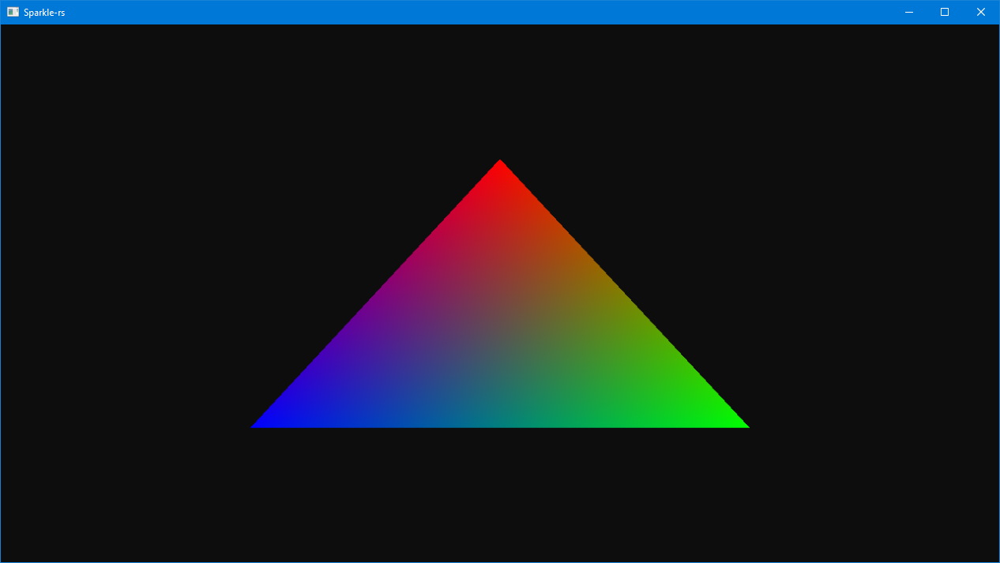

# sparkle-rs  

  

Rendering Engine written in rust as I am learning D3D11 and rust.  

Also experimenting a bit with cross platform support using OpenGL as backend on linux.  
However, this is not the focus and may lag behind / not work at all at times.

