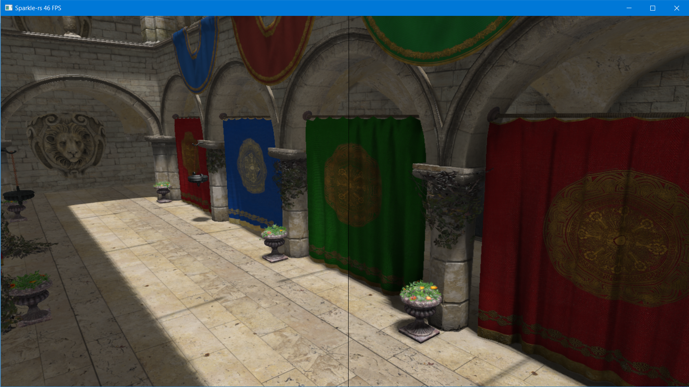

# sparkle-rs: D3D11 Engine written in Rust  

## Features  
* Deferred Rendering for opaque geometry  
* Transparency with a forward pass on transparent geometry  
* Shadow Mapping with PCSS for directional light  
* HBAO+ by [nVidia](https://www.geforce.com/hardware/technology/hbao-plus)  
* Normal maps  

## Planned  
* Shadow Mapping for other light types  
* Volumetric Light  
* 2D rendering for HUD overlays  

  
Left: No SSAO. Right: HBAO+ from nVidia.  

Engine written in rust and using DirectX as backend.

