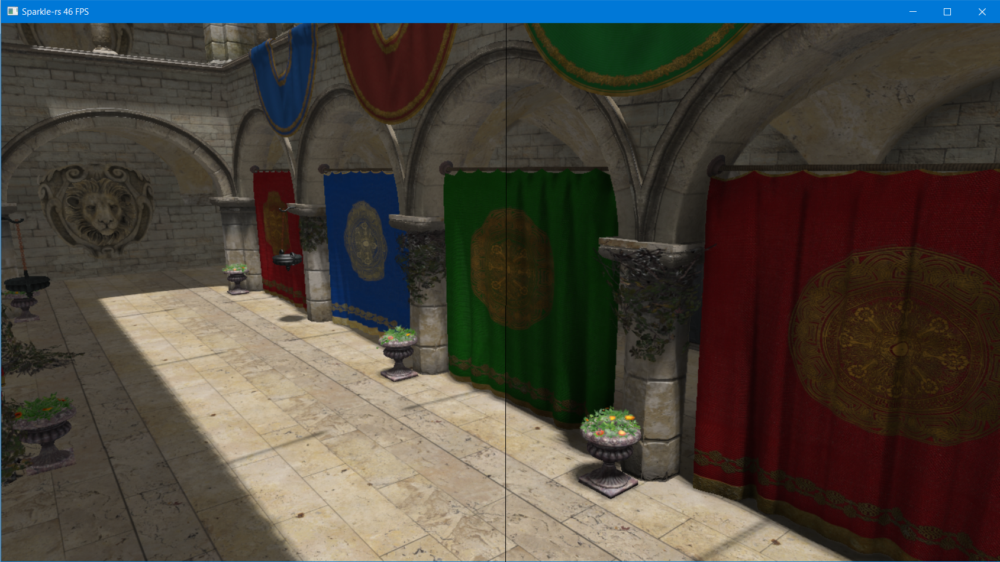

# sparkle-rs: Vulkan Engine written in Rust

## Features
* Vulkan 1.3 backend via `ash` (raw bindings, no abstraction layer)
* Deferred rendering (G-buffer: world position, packed normals/roughness, albedo/metallic)
* Forward pass for transparent geometry with alpha blending
* PBR shading (Cook-Torrance BRDF: GGX NDF, Schlick-Smith geometry, Schlick Fresnel)
* Hardware ray tracing (optional, `VK_KHR_ray_tracing_pipeline` + `VK_KHR_acceleration_structure`)
  * Soft shadows with Poisson disk sampling per light (configurable sample count)
  * Any-hit alpha cutout for foliage/masked geometry
  * Per-frame TLAS; opaque and transparent SBT hit groups
* Raster shadow mapping (PCF Poisson disk, 2048x2048) when RT is unavailable
* Normal mapping with TBN matrix
* Parallax occlusion mapping (steep parallax, height in normal texture alpha)
* Cubemap skybox
* HDR output (ST.2084 / PQ tonemapping, `VK_COLOR_SPACE_HDR10_ST2084_EXT`); SDR fallback with ACES + sRGB
* Bindless descriptors (1024-slot texture array, `UPDATE_AFTER_BIND`)
* Vulkan 1.3 dynamic rendering (no `VkRenderPass`/`VkFramebuffer`)
* Procedural terrain with GPU compute asset scattering (indirect draw) (WIP)
* glTF scene loading
* egui editor overlay: hierarchy, inspector, lights panel, transform gizmo, undo/redo, scene save/load (RON)
* Shaders written in [Slang](https://shader-slang.com/), compiled to SPIR-V

## Planned
* SSAO (infrastructure in place; shader body in progress)
* Shadow mapping for point/area lights (raster path)
* Volumetric lighting
* GPU timestamp queries for precise frame timing
* HDR surface metadata (`VK_EXT_hdr_metadata`)
* more 2D rendering / HUD overlays via egui
